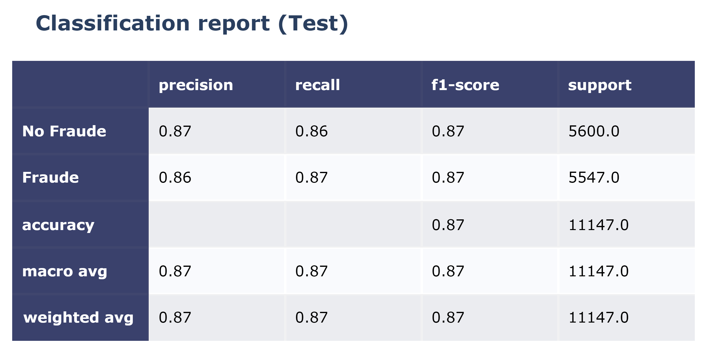
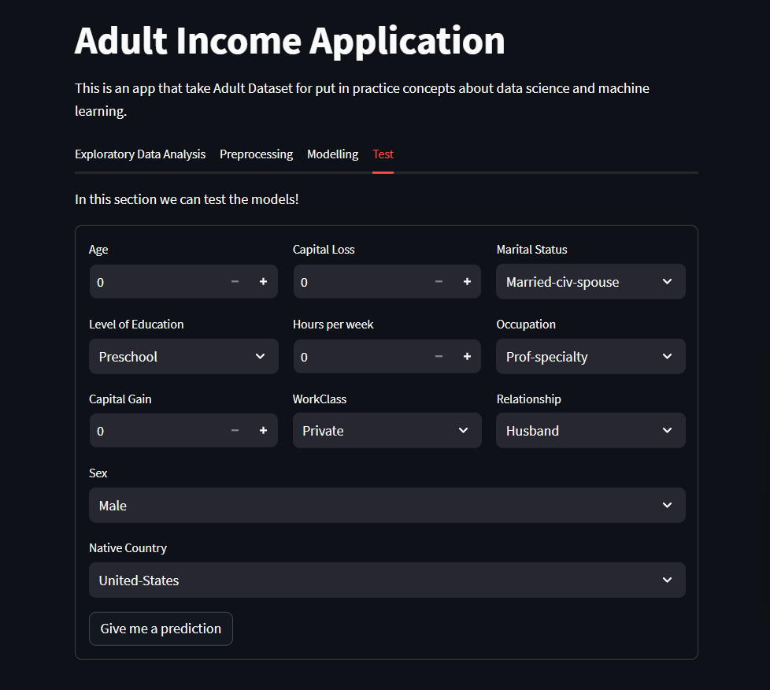

# Clasificación anual de ingresos
Proyecto destinado a la predicción del ingreso anual en USD, el objetivo es clasificar si el ingreso de un individuo superará el umbral de $50K.

## Descripción
A partir del dataset Adult Income se realizaron una serie de transformaciones para obtener un conjunto de datos util. La base de datos resultante se utilizo para entrenar diferentes modelos de clasificación así como para identificar patrones e insights. 
## Resumen técnico
La base de datos en crudo cuenta con los campos:

A partir del conjunto de datos anterior se realizaron las actividades:
1. Adquisición y comprensión de datos
2. Limpieza y preparación de los datos
3. Analisis exploratorio
4. Preprocesamiento de los datos
5. Modelado

En este trabajo se usó un modelo Random Forest.
## Resultados

## Despligue
Bajo el framework Streamlit

